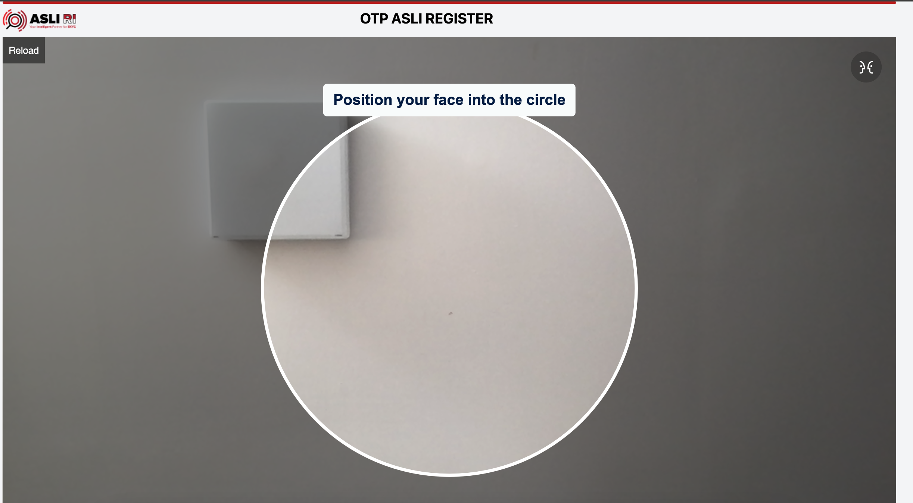

# ASLIRI OTP BIOMETRIC WEB
OTP by ASLIRI for your web apps. You can screening your client with OTP Biometric. 

We have 2 version. 
- version 1 is register and verification with OTP Biometric
- version 2 is verification with OTP Biometric

## Get Started
Before integrating ASLIRI OTP Web, you need to have an authorization for credentials. Please contact [ASLIRI](https://asliri.id) to get credentials. You will get:
1. **api-register-url**
3. **api-verification-url**
3. **token-sdk**

```
Note: if you choose version 2 only need api verification url and token sdk
```


## How does the ASLIRI OTP Biometric Web process work?
## Version 1
### REGISTER
1. Hit the API to **api-register-url**.
2. Your client will receive an OTP link via user email.
3. The user clicks the link and will visit the OTP ASLIRI page (need allow camera).
4. If failed, the user will receive a notification to reload the page
5. If successful, ASLIRI will redirect to the callback URL with the **status** success and **template** (for verification data).
6. User will receive email status activation. <br/>
```
Please save template to your database because it will be used for verification data.
```

### VERIFICATION
1. Hit the API to **api-verification-url**.
2. Your client will receive an OTP link via user email.
3. The user clicks the link and will visit the OTP ASLIRI page (need allow camera).
4. If failed, the user will receive a notification to reload the page.
5. If successful, ASLIRI will redirect to the callback URL with **status** success, **verify_score** [0-100] and **verify** true/false
6. User will receive email status activation.
```
verify is status from ASLIRI, your side can manage by verify_score
```

## Version 2

### VERIFICATION
1. Hit the API to **api-verification-url**.
2. Your client will receive an OTP link via user email.
3. The user clicks the link and will visit the OTP ASLIRI page (need allow camera).
4. If failed, the user will receive a notification to reload the page.
5. If successful, ASLIRI will redirect to the callback URL with **status** success, **verify_score** [0-100] and **verify** true/false
6. User will receive email status activation.
```
verify is status from ASLIRI, your side can manage by verify_score
```


## How do I integrate ASLIRI OTP BIOMETRIC Web ?
## Version 1
### REGISTER
#### 1. Hit the API to register

URL: **{api-register-url}**  <br/>
Method: POST <br/>

Sample Header Request :
```
Content-Type: "application/json" // json request
token-sdk: "1Z234567A" // token-sdk
```
Sample JSON Body Request:  
```
{
    "app_id": "APPID1", // Your app id
    "user_id": "USERID1", // Your user id
    "name": "CALLNAME", // Your client name
    "pob": "JAKARTA", // Your client place of birth
    "dob": "2024-01-01", // Your client date of birth
    "email": "email@gmail.com", // Your client email
    "phone": "085123456789", // Your client phone number
    "callback_url": "https://domain.com", // Your callback url
    "app_session": "APPSESSION1" // Your app session
}
```

Sample Response :
```
{
    "code": 200, // status code
    "message": "success", // message
    "result": { // result reqid
        "req_id": "hyjxPh5RXuds5Y4F3FMQ%2FBDYFnF8%2F4qvhlog6MzhAnCR%2BA6Uhkqwv17feZm7FCkWYaCQOc1NDhBI42oA95%2BiEc%2FT8aglujzX4%2BDJWAlqe4%2BUMIm275WITfJEeKTKUdn26ubLf0ePUrsu3Jg5"
    }
}
```

Please note: only code **200** is success.

#### 2. Your client will receive an OTP link via user email (sample: email@gmail.com)


#### 3. The user clicks the link and will visit the OTP ASLIRI page


allow camera


Start face verification



#### 4. If failed, the user will receive a notification to reload the page


#### 5. If successful, ASLIRI will redirect to the callback URL with template (for verification data)
 <br/>
Sample Redirect to URL : <br/>
https://domain.com/?status=success&template=o27387384729834929yDBXGm68emeF9jYBQQ%2FZnXS2mFECeU56QfQVKpNBi%2B%2FejOOz2BM1Xrx58Jn6RvTouys6ByoZvrKYmhUUX2bxd00hZedBZUzHgyRLQy6je7RAAScjdSnd4xTPjnWWhcPsvxr9fjHX0MUdnqiCyfR7Ko%3D

*your side save **template** for verification*

#### 6. User will receive email status activation
 <br/>
  <br/>
Sample URL : https://domain.com
<hr/>

### VERIFICATION
#### 1. Hit the API for verification
URL: **{api-verification-url}**  <br/>
Method: POST <br/>

Sample Header Request :
```
Content-Type: "application/json" // json request
token-sdk: "1Z234567A" // token-sdk
```
Sample Body Request :
```
{
    "app_id": "APPID1", // your appid
    "user_id": "USERID1", // your userid
    "template": "o27387384729834929yDBXGm68emeF9jYBQQ%2FZnXS2mFECeU56QfQVKpNBi%2B%2FejOOz2BM1Xrx58Jn6RvTouys6ByoZvrKYmhUUX2bxd00hZedBZUzHgyRLQy6je7RAAScjdSnd4xTPjnWWhcPsvxr9fjHX0MUdnqiCyfR7Ko%3D", // template get after register success
    "callback_url": "https://domain.com", // your callback url
    "app_session": "APPSESSION2" // your app session
}
```

Sample Response :
```
{
    "code": 200, // status code
    "message": "success", // message
    "result": { // result reqid
        "req_id": "2F4qvhlog6MzhAnCR%2BA6Uhkqwv17feZm7FCkWYaCQOc1NDhBI42oA95%2BiEc%2FT8aglujzX4%2BDJWAlqe4%2BUMIm275WITfJEeKTKUdn26ubLf0ePUrsu3Jg5"
    }
}
```

Please note: only code **200** is success.

#### 2. Your client will receive an OTP link via user email.


#### 3. The user clicks the link and will visit the OTP ASLIRI page.


allow camera


Start face verification


#### 4. If failed, user will receive notify for reload page


#### 5. If successful, ASLIRI will redirect to the callback URL with **status** success, **verify_score** [0-100], and **verify** true
 <br/>
Sample Redirect to URL : <br/>
https://domain.com/?status=success&verify_score=94&verify=true

or

https://domain.com/?status=success&verify_score=71&verify=false

#### 6. User will receive email status activation


 <br/>
Sample URL : https://domain.com


## Version 2
### VERIFICATION
#### 1. Hit the API for verification
URL: **{api-verification-url}**  <br/>
Method: POST <br/>

Sample Header Request :
```
Content-Type: "application/json" // json request
token-sdk: "1Z234567A" // token-sdk
```
Sample Body Request :
```
{
    "app_id": "APPID1", // your appid 
    "user_id": "123456", // your userid
    "name": "CALLNAME", // your client name
    "pob": "Bogor", // place of birth
    "dob": "1990-01-01", // date of birth
    "email": "tumbalac002@gmail.com", // email
    "phone": "085123456789", // phone
    "callback_url": "http://localhost:3000",
    "app_session": "app123456xyz", // app session
    "image": "{{base64image}}"
}
```

Sample Response :
```
{
    "code": 200, // status code
    "message": "success", // message
    "result": { // result reqid
        "req_id": "2F4qvhlog6MzhAnCR%2BA6Uhkqwv17feZm7FCkWYaCQOc1NDhBI42oA95%2BiEc%2FT8aglujzX4%2BDJWAlqe4%2BUMIm275WITfJEeKTKUdn26ubLf0ePUrsu3Jg5"
    }
}
```

Please note: only code **200** is success.

#### 2. Your client will receive an OTP link via user email.


#### 3. The user clicks the link and will visit the OTP ASLIRI page.


allow camera


Start face verification


#### 4. If failed, user will receive notify for reload page


#### 5. If successful, ASLIRI will redirect to the callback URL with **status** success, **verify_score** [0-100], and **verify** true
 <br/>
Sample Redirect to URL : <br/>
https://domain.com/?status=success&verify_score=94&verify=true

or

https://domain.com/?status=success&verify_score=71&verify=false

#### 6. User will receive email status activation


 <br/>
Sample URL : https://domain.com
